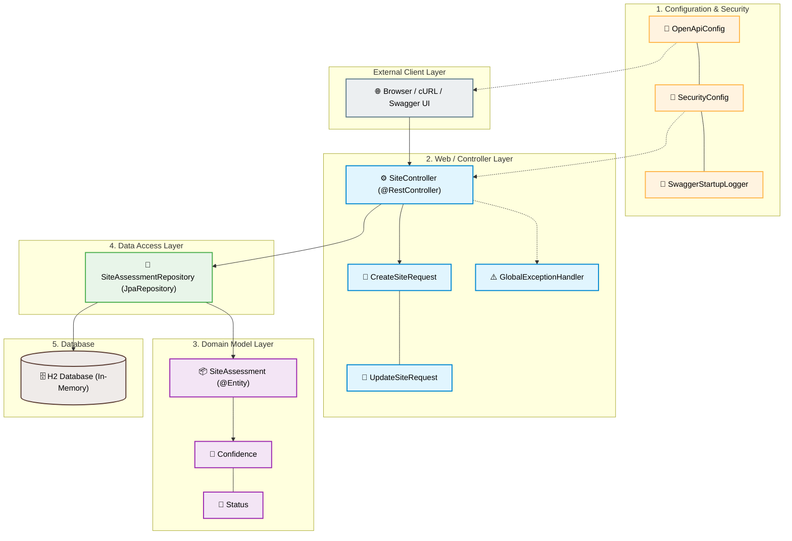

```mermaid
graph TB
    %% Styling Definitions with explicit black text color
    classDef client fill:#eceff1,stroke:#607d8b,stroke-width:2px,color:#000;
    classDef config fill:#fff3e0,stroke:#ffb74d,stroke-width:2px,color:#000;
    classDef web fill:#e1f5fe,stroke:#0288d1,stroke-width:2px,color:#000;
    classDef biz fill:#f3e5f5,stroke:#9c27b0,stroke-width:2px,color:#000;
    classDef data fill:#e8f5e9,stroke:#4caf50,stroke-width:2px,color:#000;
    classDef db fill:#efebe9,stroke:#5d4037,stroke-width:2px,color:#000;

    %% Client Layer
    subgraph ClientLayer ["External Client Layer"]
        Client["🌐 Browser / cURL / Swagger UI"]
    end

    %% Configuration & Infrastructure
    subgraph ConfigLayer ["1. Configuration & Security"]
        OpenApiConfig["📄 OpenApiConfig"] --- SecurityConfig["📄 SecurityConfig"] --- SwaggerLog["📄 SwaggerStartupLogger"]
    end

    %% Web/API Entry Layer
    subgraph WebLayer ["2. Web / Controller Layer"]
        SiteController["⚙️ SiteController (@RestController)"]
        CreateSiteRequest["📄 CreateSiteRequest"] --- UpdateSiteRequest["📄 UpdateSiteRequest"]
        GlobalExceptionHandler["⚠️ GlobalExceptionHandler"]
    end

    %% Domain/Model Layer
    subgraph ModelLayer ["3. Domain Model Layer"]
        SiteAssessment["📦 SiteAssessment (@Entity)"]
        Confidence["📄 Confidence"] --- Status["📄 Status"]
    end

    %% Data Access Layer
    subgraph DataLayer ["4. Data Access Layer"]
        SiteAssessmentRepository["💾 SiteAssessmentRepository (JpaRepository)"]
    end

    %% Infrastructure Database
    subgraph DBLayer ["5. Database"]
        H2DB[("🗄️ H2 Database (In-Memory)")]
    end

    %% Dense Flow Connections
    Client --> SiteController
    OpenApiConfig -.-> Client
    SecurityConfig -.-> SiteController
    
    SiteController --> CreateSiteRequest
    SiteController -.-> GlobalExceptionHandler

    %% Direct Controller to Repo Pipeline
    SiteController --> SiteAssessmentRepository
    SiteAssessmentRepository --> SiteAssessment
    SiteAssessment --> Confidence
    SiteAssessmentRepository --> H2DB

    %% Apply Styles
    class Client client;
    class OpenApiConfig,SecurityConfig,SwaggerLog config;
    class SiteController,CreateSiteRequest,UpdateSiteRequest,GlobalExceptionHandler web;
    class SiteAssessment,Confidence,Status biz;
    class SiteAssessmentRepository data;
    class H2DB db;
```