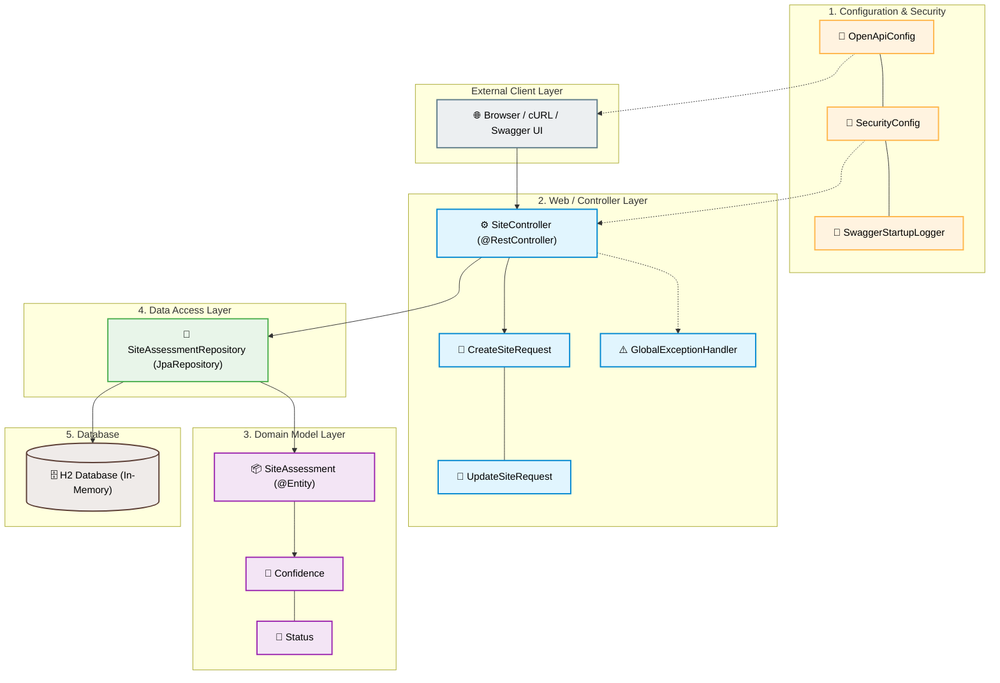

# Site Assessment API

## Quick Start

### Prerequisites
- Java 21 or later
- Maven - either installed locally or use the included Maven wrapper

### Build & Run

**Unix (Linux / macOS)**
```bash
./mvnw spring-boot:run
```
**Windows (PowerShell)**
```powershell
.\mvnw.cmd spring-boot:run
```

The application starts on `http://localhost:8080`.

### Default Credentials
- **API/Swagger UI:** `user` / `password`
- **H2 Console:** `sa` (no password)

## Accessing the API

- **Swagger UI:** http://localhost:8080/swagger-ui.html  
  Authenticate with the API credentials above to execute requests interactively.
- **H2 Console (optional):** http://localhost:8080/h2-console  
  JDBC URL: `jdbc:h2:mem:testdb`  
  User: `sa` (no password)

## API Endpoints

All endpoints are prefixed with `/api/sites` and require authentication.

| Method | Path             | Description              |
|--------|------------------|--------------------------|
| GET    | /api/sites       | List all assessments     |
| GET    | /api/sites/{id}  | Retrieve a single site   |
| POST   | /api/sites       | Create a new site        |
| PUT    | /api/sites/{id}  | Update an existing site  |
| DELETE | /api/sites/{id}  | Delete a site            |

### Example: Create a Site

**Unix (bash/zsh)**
```bash
curl -X POST http://localhost:8080/api/sites \
  -H "Content-Type: application/json" \
  -u user:password \
  -d '{
    "name": "Permian Basin Alpha",
    "latitude": 31.2,
    "longitude": -102.5,
    "basin": "Permian",
    "estimatedVolume": 500,
    "confidence": "HIGH",
    "status": "DRAFT"
  }'
```

**Windows (PowerShell)**
```powershell
curl.exe -X POST http://localhost:8080/api/sites `
  -H "Content-Type: application/json" `
  -u user:password `
  -d '{\"name\": \"Permian Basin Alpha\", \"latitude\": 31.2, \"longitude\": -102.5, \"basin\": \"Permian\", \"estimatedVolume\": 500, \"confidence\": \"HIGH\", \"status\": \"DRAFT\"}'
```

Successful creation returns `201 Created` with the new resource and a
`Location` header pointing to `/api/sites/{id}`.

## Tech Stack

- Java 21, Spring Boot 4.1, Spring MVC
- Spring Data JPA with H2
- Spring Security (HTTP Basic)
- Springdoc OpenAPI for Swagger UI
- Lombok, JUnit 5, Mockito
- Virtual threads enabled (`spring.threads.virtual.enabled=true`)

## Project Layout

    src/main/java/com/demo/siteapi/
    ├── config/          SecurityConfig, OpenApiConfig, SwaggerStartupLogger
    ├── controller/      SiteController
    ├── dto/             CreateSiteRequest, UpdateSiteRequest
    ├── exception/       GlobalExceptionHandler
    ├── model/           SiteAssessment, Confidence, Status
    ├── repository/      SiteAssessmentRepository
    └── service/         SiteAssessmentService

## Running Tests

**Unix**
```bash
./mvnw test
```

**Windows (PowerShell)**
```powershell
.\mvnw.cmd test
```

Test cases use `@WebMvcTest` with mocked service layer and verify
HTTP semantics, validation errors, and authentication requirements.

## Notes

- The H2 database is in‑memory and resets on restart. To switch to a
  persistent database (PostgreSQL, SQL Server), change the datasource
  configuration in `application.properties`.
- The current authentication uses in‑memory Basic Auth. For a production
  deployment this would be replaced by OAuth2/JWT, as noted in the
  associated interview presentation.

## Project Structure Diagram (Mermaid)

